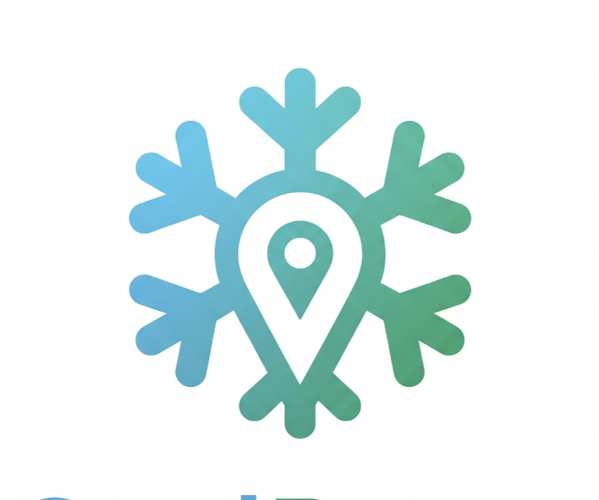
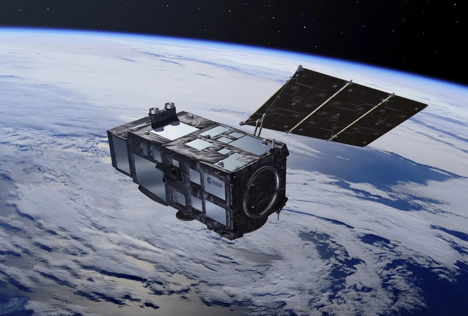
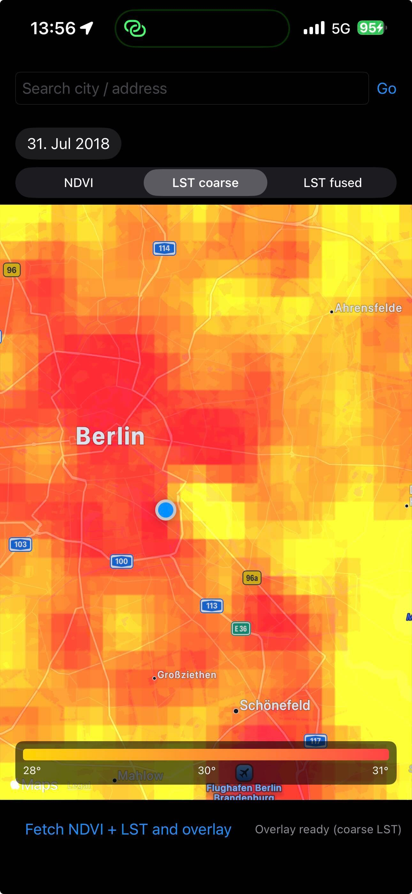
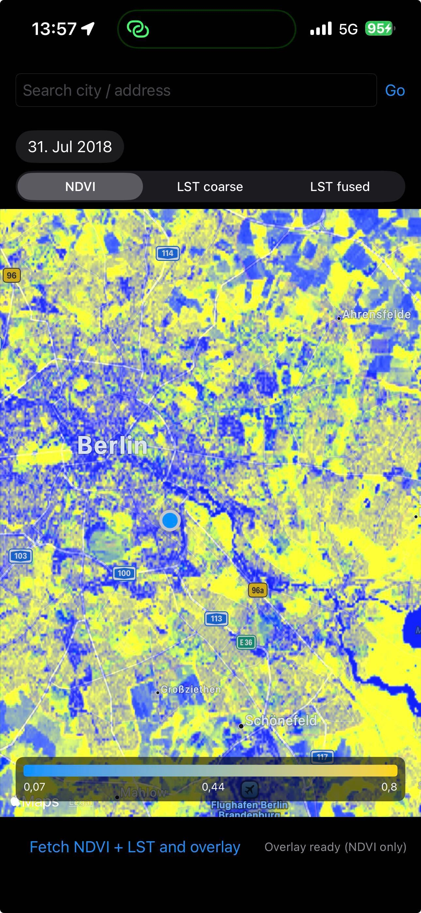
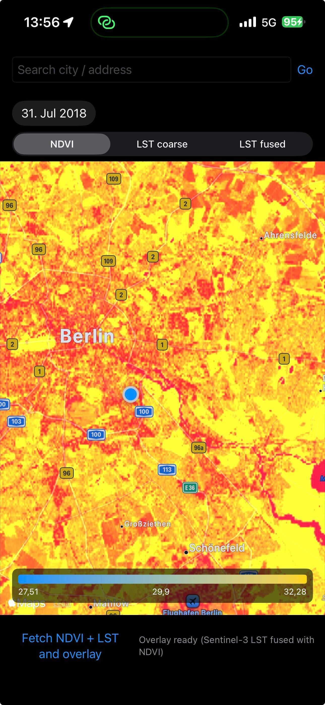

  <picture>
    <source srcset="assets/logo/logo-dark.png" media="(prefers-color-scheme: dark)">
    
  </picture>
  
CoolCities

  
3rd Prize Cassini Hackathon 2025

  
Germany

## Team

- [Stephen](https://github.com/sjtobin) – Cognitive scientist and linguist (PhD) with experience in data analysis and computational modeling. Brings systems thinking and user insight to connect data and experience.
- [Laurent](https://github.com/multitudes) – iOS engineer with expertise in Swift, UX, and frontend development. Leads interface design and implementation, turning concepts into intuitive user experiences.
- [Jen](https://github.com/jng-jng) - User experience expert, her role is to manage and analyze all customer and potential customer interactions and data
- [Matthias](https://github.com/uschi909) – Data scientist specializing in analysis and modeling. Handles data processing and fusion of Sentinel and Galileo datasets into usable temperature and navigation layers.

## Our Idea
- Category "Beyond Horizons – Redefining Travel with Space Innovation"

CoolCities helps tourists and locals plan their days and routes to stay comfortable during hot weather and to avoid heat exposure. Using high-resolution satellite-derived temperature and vegetation maps, the app identifies cooler streets, shaded paths, parks and green corridors and suggests alternative routes and transport modes (walking, bikes, scooters, roller skates) that prioritize lower heat exposure. The suggestions aim at improving comfort and health while encouraging low‑emission, active mobility.

### Why this matters

- Climate warming is increasing the number, extent and severity of very hot places worldwide. Urban areas are particularly affected: dense built materials (asphalt, concrete), multi-lane roads, traffic, tall buildings that trap heat, and clusters of electrical equipment create urban heat islands and strong microclimates.
- These microclimates mean some city blocks — busy streets, enclosed courtyards, or areas with little vegetation — can be much hotter than nearby locations. That difference matters for comfort, health (heat stress), and tourism experience.
- By combining Sentinel-2 and Sentinel-3 observations with processing and downscaling methods, we can produce high-resolution surface-temperature and vegetation maps (targeting ~10 m spatial precision). With calibration and modelling, these layers allow us to infer near-ground walking-level temperatures and identify cooler corridors at neighborhood scale.
- With those layers we can offer routing that trades a small amount of travel time for substantially lower heat exposure — e.g., a shaded bike route instead of a sunny arterial — benefiting tourists and locals during hot months in Europe and year-round in tropical regions. This routing is useful for general users and especially important for heat-vulnerable people.

**Limitations & considerations:** the app uses aggregated environmental layers and modelling to infer near-ground conditions; local shading, micro-sprinklers, or transient heat sources may cause variations. Routing decisions should also weigh safety, accessibility, and user preferences.

## Use of EU Space Technologies
CoolCities combines data from Copernicus Sentinel 2 and 3 to detect land temperature and vegetation cooling, providing temperature maps at 10 m resolution.  
Galileo global navigation satellites provide precise positioning for routing through the temperature map.  
CoolCities translates EU space data into user comfort and wellness.

## How we use the data
<!-- [See the data aspect of the project here](data.md) -->
# Getting the raw data

We fetch and process satellite imagery from the Sentinel Hub service to generate the overlay layers used in the app.

  
  

### How it Works
We produce two main overlay types:

- High-resolution NDVI (vegetation index) derived from Sentinel-2 imagery.
- Land Surface Temperature (LST) derived from Sentinel-3 SLSTR observations.

Summary of the processing pipeline:

1. **Authentication** — the app obtains an OAuth access token (cached) using private client credentials. Keep credentials out of the public repository.
2. **Server-side processing** — the app sends a POST to the Sentinel Hub Process API with geographic bounds, time range and a processing script (evalscript) that extracts and encodes the requested measurement.
3. **Image encoding** — the Process API returns an image (typically PNG) where measurements are encoded as grayscale values (0–255).
4. **Client decoding & scaling** — the client decodes the PNG into a raster and maps pixel values back into scientific units (NDVI, °C) using the same scaling factors applied server-side.
5. **Calibration & downscaling** — we apply fusion and downscaling techniques to produce near-ground, walking-level estimates at neighborhood scale (targeting ~10 m precision), using in-situ sensors for calibration where available.
6. **Fallback & caching** — cached tiles or synthetic data are used when external calls fail or to speed up the UI for demos.

  
  
  

### Your Questions Answered

*   **How do I get the token?**
    The app's authentication routine handles this. It sends a POST request with your client ID and client secret to the Sentinel Hub token endpoint. Store these credentials securely (for example, in environment variables or a private secrets store) and do not commit them to the repository. Register for a free trial account on the [Sentinel Hub website](https://www.sentinel-hub.com/) to obtain a client ID and secret.

*   **Which satellites are involved?**
    *   **Sentinel-2**: Used for high-resolution NDVI data (example source: sentinel-2-l2a).
    *   **Sentinel-3**: Used for coarse-resolution LST data from the SLSTR instrument (example source: sentinel-3-slstr).

*   **What are the endpoints?**
    The Process API uses two main endpoints (examples shown):
    *   Token endpoint (example): `https://services.sentinel-hub.com/oauth/token`
    *   Process API endpoint (example): `https://services.sentinel-hub.com/api/v1/process`

*   **How is the data formatted?**
    *   **Request**: The app sends a POST request with a JSON body to the Process API. The JSON describes the geographic bounding box, time range, chosen data source, and includes a server-side processing script (evalscript) that computes the requested measurement.
    *   **Response**: The API can return a PNG image where scientific values are encoded as grayscale (0–255). The app decodes the PNG into a raster and converts pixel values back into floating-point scientific units (NDVI or temperature) using the same scaling applied server-side.

## Resources
The Cassini Hackathon 2025 call for submissions:  
[https://www.cassini.eu/hackathons/germany](https://www.cassini.eu/hackathons/germany)

Our project page:  
[https://taikai.network/cassinihackathons/hackathons/eu-space-consumer-experience/projects/cmhoxqgry003vxtcrhox121xq/idea](https://taikai.network/cassinihackathons/hackathons/eu-space-consumer-experience/projects/cmhoxqgry003vxtcrhox121xq/idea) 

Business Design Playbook:  
[https://www.cassini.eu/hackathons/sites/default/files/2024-11/Business%20Design%20Playbook_update.pdf](https://www.cassini.eu/hackathons/sites/default/files/2024-11/Business%20Design%20Playbook_update.pdf)  

Air Pollution API concept:  
[https://openweathermap.org/api/air-pollution](https://overpass-turbo.eu)  

Overpass-turbo is a web-based data mining and visualization tool for OpenStreetMap:  
[https://overpass-turbo.eu](https://overpass-turbo.eu)  

A similar open source project which is more general in scope:  
[https://www.hotmaps-project.eu](https://citiwatts.eu)

which then moved to:  
[https://citiwatts.eu](https://citiwatts.eu)  
[https://citiwatts.eu/map](https://citiwatts.eu/map) 

Some tools at our disposition:  
[https://www.cassini.eu/hackathons/tools](https://www.cassini.eu/hackathons/tools)  

Participants Playbook:  
[https://www.cassini.eu/hackathons/sites/default/files/2025-11/Participant%20Playbook_10th%20CASSINI%20Hackathon_1.pdf](https://www.cassini.eu/hackathons/sites/default/files/2025-11/Participant%20Playbook_10th%20CASSINI%20Hackathon_1.pdf)

Previous Hackathons code base for inspiration:  
[https://github.com/cassinihackathons](https://github.com/cassinihackathons)

Some interesting Hardware we did not have the chance to inspect yet:  
[https://kineis.com(https://kineis.com)]  

The satellites:  
[https://dataspace.copernicus.eu/data-collections/copernicus-sentinel-missions](https://dataspace.copernicus.eu/data-collections/copernicus-sentinel-missions)

You can register for a free account (one month trial) on the Sentinel Hub website to get your own client ID and secret and make API calls:  
[https://www.sentinel-hub.com ](https://www.sentinel-hub.com ) 

**Sentinel Hub documentation**.  
The "Process API" is the most relevant part for our app:  
[https://docs.sentinel-hub.com/api/latest/api/process/](https://docs.sentinel-hub.com/api/latest/api/process/)
